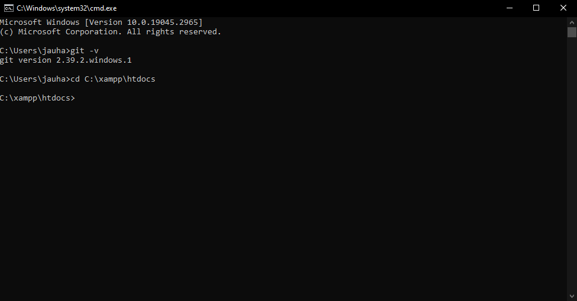
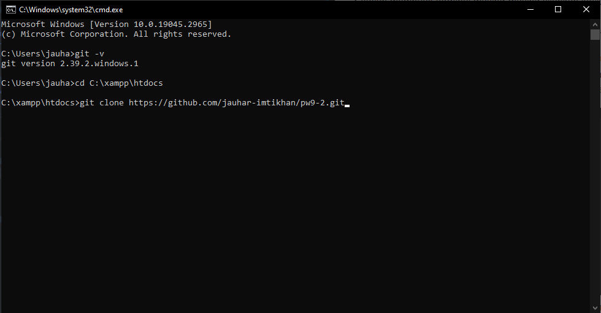
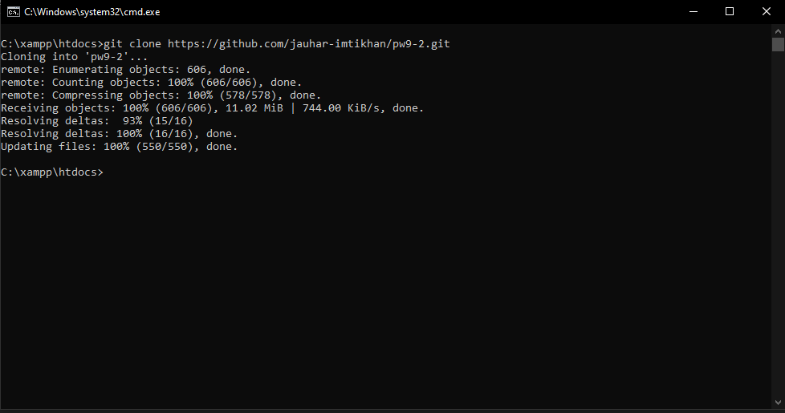
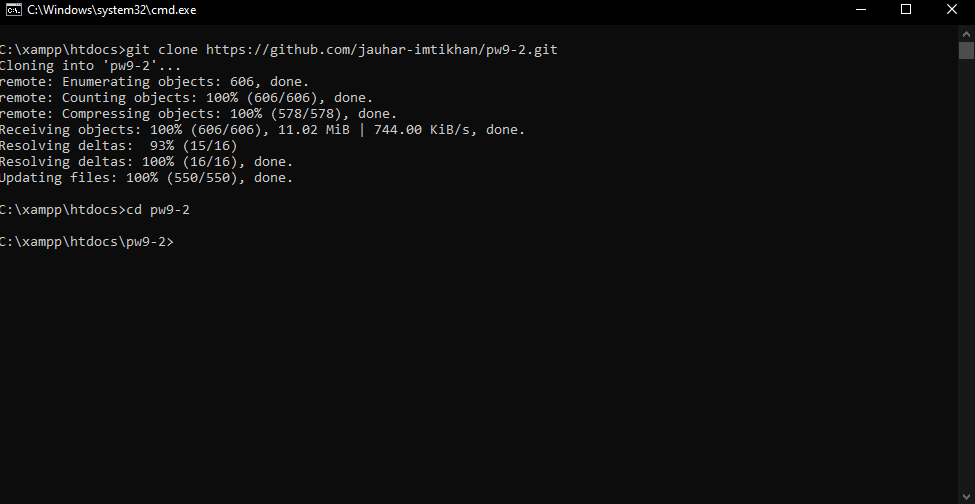
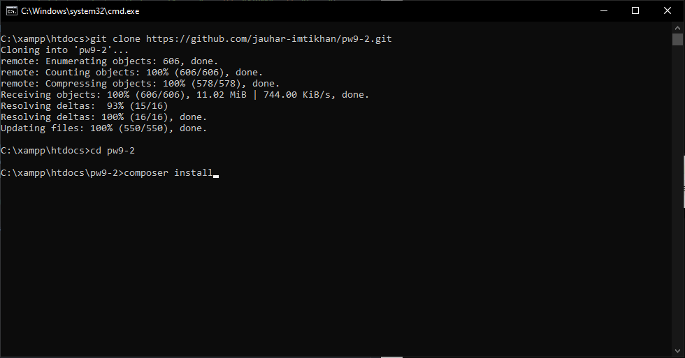
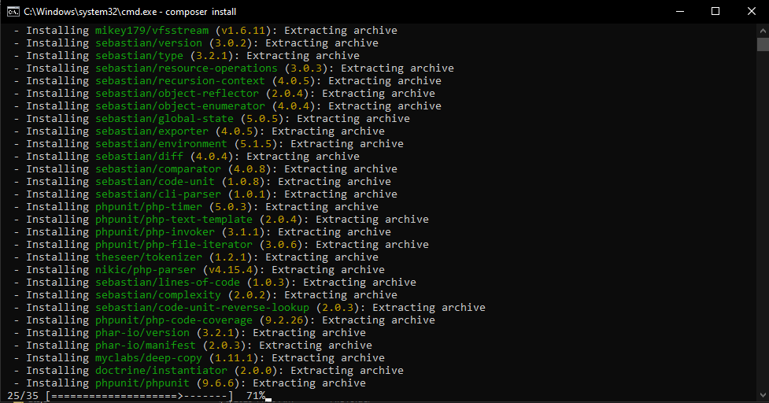
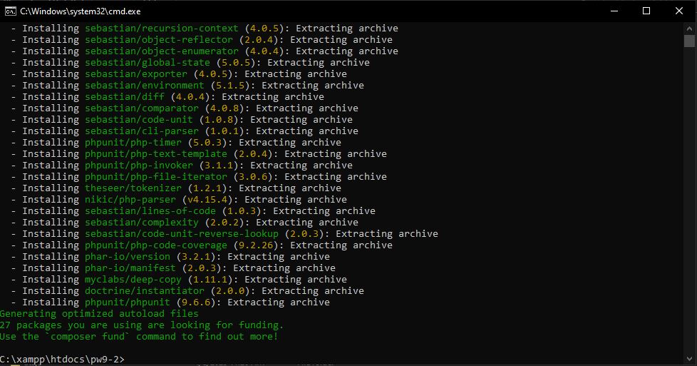

<center>
<h1 style="color: red; text-decoration: underline;">INSTALASI</h1>
</center>

- [ ] Setelah membuka terminal masing-masing silahkan ketikkan perintah `git -v`,
      untuk mengetahui apakah git sudah terinstall atau belum, jika sudah
      terinstall maka akan keluar tulisan seperti ini    
      `git version 2.39.2.windows.1`
      
- [ ] Buka terminal VSCODE kalian jika tidak punya VSCODE silahkan buka CMD atau terminal lainnya.
Setelah membuka terminal masing-masing silahkan ketikkan perintah

```sh
git -v
```

- [ ] Perintah diatas berguna untuk mengetahui apakah git sudah terinstall atau belum, jika sudah terinstall maka akan keluar tulisan seperti ini 
      `git version 2.39.2.windows.1`
     
- [ ] Langkah selanjutnya buka terminal kalian dan pastikan sudah berada pada
      direktori `C:\xampp\htdocs`, jika belum silahkan ketikan pada terminal
      kalian

```sh
cd C:\xampp\htdocs
```

- [ ] maka direktori akan berpindah menjadi seperti ini



- [ ] Langkah selanjutnya kalian ketikkan kode ini pada terminal kalian

```sh
git clone https://github.com/jauhar-imtikhan/pw9-2.git
```



- [ ] Tunggu prosess download selesai.



- [ ] Setelah prosess download selesai ketikkan pada terminal kalian

```sh
cd pw9-2
```

- [ ] lalu tekan enter maka direktori akan berpindah menjadi
      `C:\xampp\htdocs\pw9-2`



- [ ] Kemudian ketikkan pada terminal kalian perintah

```sh
composer install
```



- [ ] Tunggu prosess download sampai selesai



- [ ] Jika sudah selesai maka akan seperti ini



- [ ] Kemudian nyalakan `XAMPP` kalian, jika sudah silahkan sesuaikan settingan database kalian yang berada pada folder
      `app\config\Database.php`

- [ ] Setelah selesai mengatur nama database kalian, silahkan klik link di bawah

<center>
     <a href="http://127.0.0.1/pw9-2">Klik Disini</a>

